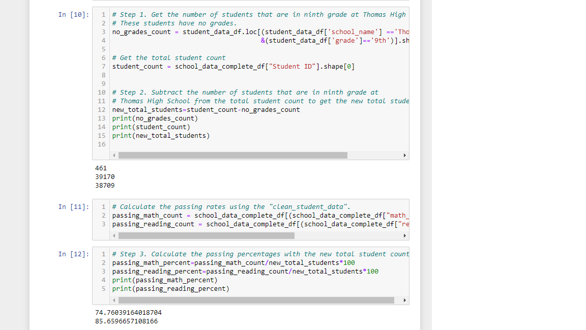

# School_District_Analysis
## Overview of School District Analysis
The school district analysis project is comprised of data throughout the school district including, the name of each student in the district, student identification number, school name, school type, school budget, etc. The goal of this project is understanding the aggregate and detail information to assess the current standing of the school district.
## Results
- **How is the district summary affected?**

The district summary was partially affected due to the size of the total number of students decreasing from 39,170 students to 38,709 students. 
- **How is the school summary affected?**

The 
- **How does replacing the ninth graders’ math and reading scores affect Thomas High School’s performance relative to the other schools?**
- **How does replacing the ninth-grade scores affect the following:**
  
  Math and reading scores by grade
  
Scores by school spending

Scores by school size

Scores by school type

## Summary
